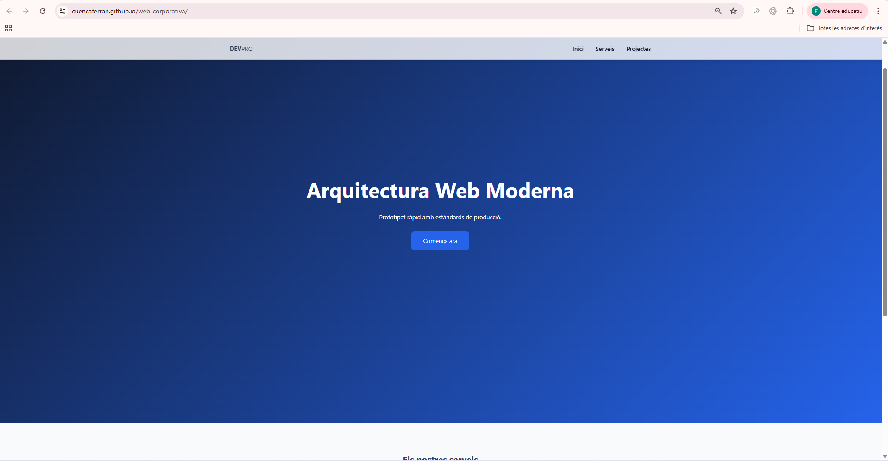
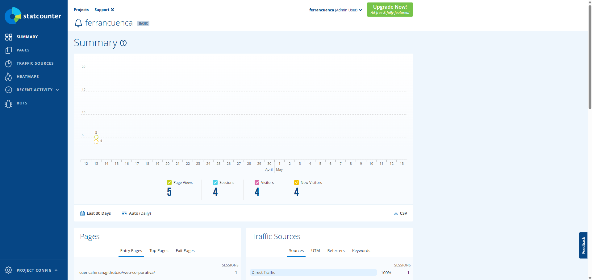
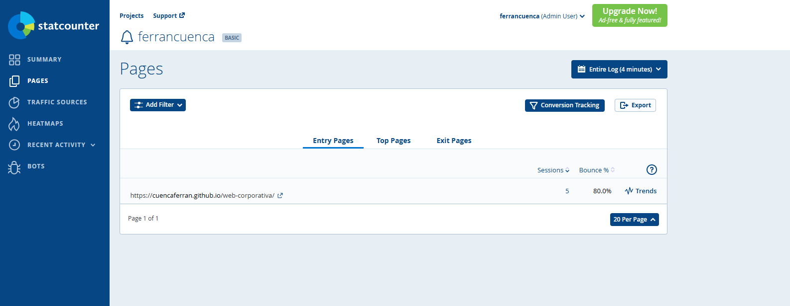
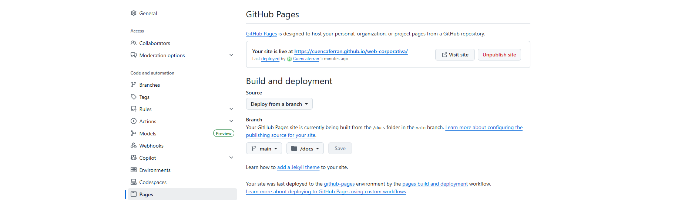
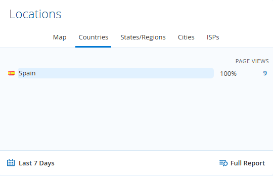
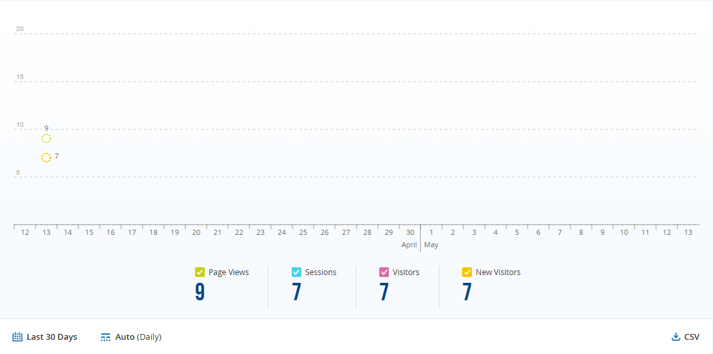

## 🔧 Solució realitzada

- Repositori GitHub: https://github.com/el-teu-usuari/foodlogistic
- Web publicada: https://el-teu-usuari.github.io/foodlogistic

La web s'ha estructurat dins la carpeta `/docs` per permetre la publicació amb GitHub Pages.

Inclou:
- Pàgina principal (index.html)
- Disseny modern i responsive
- Compliment legal (avis legal, cookies, privacitat)

- ## 📊 Analítica web amb StatCounter

S'ha integrat un comptador invisible de StatCounter per monitoritzar les visites.

Aquesta eina permet:
- Saber quants usuaris visiten la web
- Veure des d'on accedeixen
- Analitzar el comportament dels visitants

Aquesta es la meva pagina web publicada i oberta desde al navegador, com podeu veure es veu la meva url de la web adalt i al disseny general de la web. 

Aquesta captura correspon al panell de StatCounter, on es visualitza el nombre de visitants de la web, amb un total actual de 5 visites registrades, 4 sessions i 4 nous visitors. 

Aquesta captura mostra les pàgines visitades de la web segons StatCounter, on es pot observar que la pàgina principal ha registrat un total de 5 sessions amb un percentatge de rebot del 80%.

Aquesta captura mostra la configuració de GitHub Pages, on es pot veure que la web està desplegada correctament des de la branca main i la carpeta /docs, i ja es troba publicada amb una URL activa.

Aquesta captura mostra la localització dels visitants segons StatCounter, on es pot observar que el 100% de les visites provenen d’Espanya, amb un total de 9 pàgines vistes.

I ara podem veure amb aquesta imatge que la nostre web a pujat de views a 9 desde al principi de tot de la web, tots d'espanya però cada cop puja mes de visites que es lo importan aixo vol dir que haurem de fer coses i fer mes fàcil les cosees com envios... per la gent de aqui espanya. 

